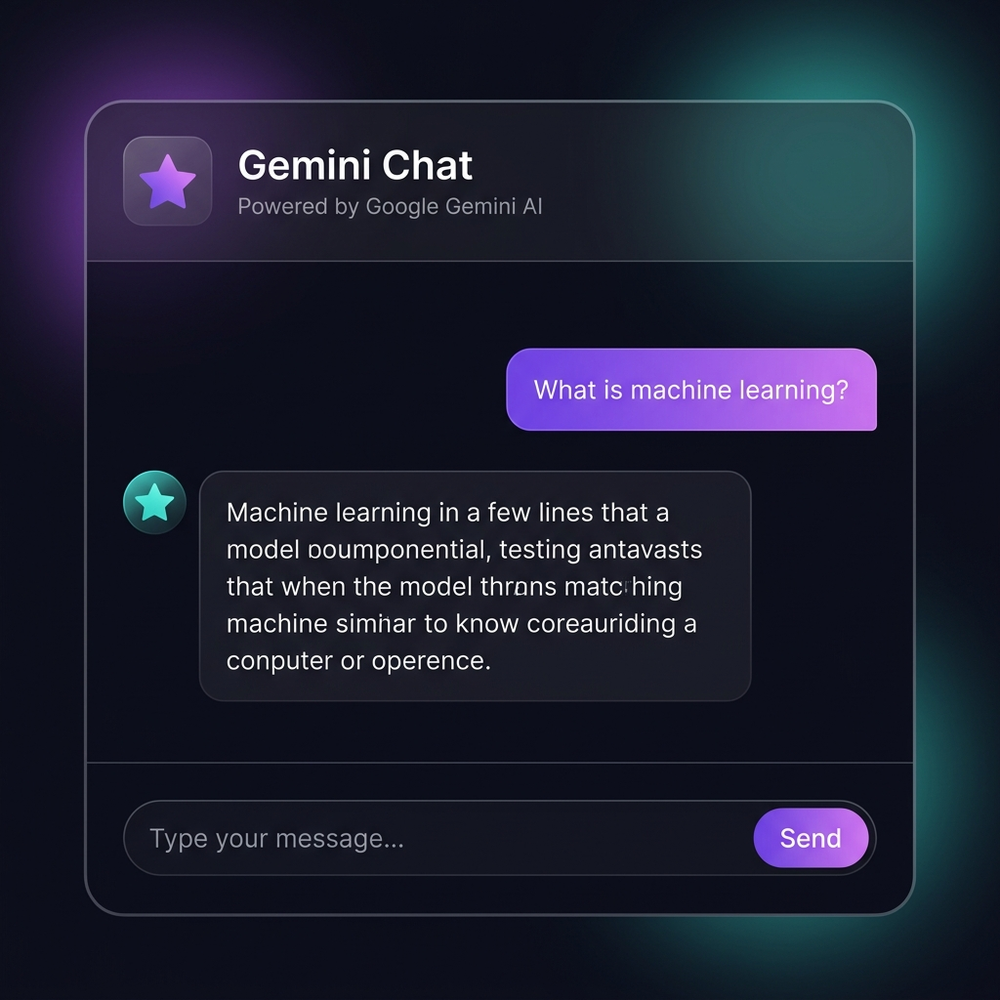

# 🤖 Gemini Chatbot

A sleek, dark-themed chatbot powered by **Google Gemini AI** with a Flask backend and vanilla HTML/CSS/JS frontend.


<p align="center">
  
</p>

> 🚀 **Live Demo:** [https://simpletgeminichatbot.vercel.app/](https://simpletgeminichatbot.vercel.app/)

## ✨ Features

- **Context-aware conversations** — chat history is maintained per session
- **Beautiful dark UI** — glassmorphism accents, smooth animations, gradient bubbles
- **Markdown rendering** — bot responses display formatted code, lists, and bold/italic text
- **Typing indicator** — animated dots while waiting for Gemini's response
- **Error handling** — friendly messages for invalid API keys, network failures, or empty input
- **Responsive design** — works on desktop and mobile
- **New chat button** — reset the conversation with one click

## 📁 Project Structure

```
chatBot/
├── app.py                     # Flask backend (API proxy, session management)
├── .env                       # Gemini API key (not committed to Git)
├── requirements.txt           # Python dependencies
├── README.md                  # This file
├── PROMPT.md                  # Prompt used to build this + learning guide
├── templates/
│   └── index.html             # Chat UI
└── static/
    ├── style.css              # Styling (dark theme, animations)
    └── script.js              # Frontend logic (fetch, rendering, markdown)
```

## 🚀 Getting Started

### Prerequisites

- **Python 3.9+** installed
- A **Gemini API key** — get one for free at [Google AI Studio](https://aistudio.google.com/app/apikey)

### 1. Clone the repo

```bash
git clone https://github.com/MohammadFayasKhan/GeminiChatbot.git
cd GeminiChatbot
```

### 2. Create a virtual environment (recommended)

```bash
python3 -m venv venv
source venv/bin/activate        # macOS / Linux
# venv\Scripts\activate         # Windows
```

### 3. Install dependencies

```bash
pip install -r requirements.txt
```

### 4. Add your API key

Create a `.env` file in the project root:

```env
GEMINI_API_KEY=AIzaSy...your_real_key_here
```

> ⚠️ **Never commit your `.env` file to version control.** It's already in `.gitignore`.

### 5. Run the app

```bash
python app.py
```

The server will start at **http://127.0.0.1:5000**. Open that URL in your browser and start chatting!

## 🔒 Security

- The API key is stored in `.env` and loaded server-side via `python-dotenv` — it is **never exposed** to the browser.
- All Gemini API calls go through the Flask backend (`/api/chat`).

## 🛠 Tech Stack

| Layer    | Technology                 |
|----------|----------------------------|
| Frontend | HTML, CSS, vanilla JS      |
| Backend  | Python, Flask              |
| AI       | Google Gemini 2.5 Flash    |
| Styling  | Custom CSS (dark theme)    |

---

## 🧠 Prompt Engineering – How This Was Built

This project was built using an AI coding assistant with a structured prompt. Full details of the prompting strategy are in [PROMPT.md](PROMPT.md).

> 💡 **Prompt Engineering Learnings:** Read the complete breakdown of techniques like constraint-based and specification prompting in [PROMPT.md](PROMPT.md) to learn how to write robust coding prompts.

### The Prompt Used

```
You are a senior full-stack developer experienced in building lightweight, production-ready demo applications with clean, well-commented code and secure API key handling.

Create a simple web-based chatbot application that uses the Gemini API to answer user queries.

## Project Requirements

**Tech Stack:**
- Frontend: HTML, CSS, JavaScript (vanilla, no framework)
- Backend: Python with Flask (to securely handle the Gemini API key, not expose it in frontend)
- API: Google Gemini API (gemini-1.5-flash or latest available model)

**Functionality:**
1. A clean, simple chat interface with:
   - A message display area (scrollable, shows conversation history)
   - A text input box and a "Send" button
   - Visual distinction between user messages and bot responses (e.g., different alignment/colors)
2. When the user submits a query:
   - Send it to the Flask backend via a POST request
   - Backend calls the Gemini API with the user's message
   - Return the response to the frontend and display it in the chat window
3. Maintain conversation context (chat history) for the current session, so follow-up questions make sense
4. Show a "typing..." or loading indicator while waiting for the API response
5. Handle errors gracefully (e.g., invalid API key, network failure, empty input) with user-friendly messages

**Project Structure:**
- app.py (Flask backend)
- templates/index.html (chat UI)
- static/style.css (styling)
- static/script.js (frontend logic, fetch calls)
- .env file for storing GEMINI_API_KEY (do not hardcode the key)
- requirements.txt

**Setup Instructions:**
- Include a README.md with steps to:
  1. Install dependencies
  2. Add the Gemini API key to .env
  3. Run the Flask app locally

**Code Quality:**
- Add comments explaining each major section
- Keep the UI minimal but modern (rounded chat bubbles, responsive layout)
- Use environment variables for the API key, loaded via python-dotenv

Please generate all the necessary files, and after creating them, explain how to run the app locally.
```

## Detailed Prompting Technique Mapping

### 1. Overview Table

| Technique | Used in This Prompt? | Why |
|---|---|---|
| **Zero-Shot Prompting** | ✅ Yes (primary technique) | Task is a well-known coding pattern (Flask + API + HTML); no need to teach a pattern via examples |
| **6-Component Structured Prompting** | ✅ Yes (Role, Task, Context, Format, Constraints) | Compensates for the absence of examples with maximum specification depth |
| **Few-Shot Prompting** | ❌ No | No input/output pairs needed — code scaffolding isn't a classification/labeling task where output format wobbles |
| **Chain-of-Thought (CoT)** | ❌ No | Not a multi-step reasoning/math/logic problem the model needs to "work through" — it's direct generation |
| **Decomposition** (CoT-adjacent principle) | ✅ Yes (borrowed principle) | Numbered functionality list breaks one large task into independently solvable sub-tasks |
| **Negative Constraints** | ✅ Yes | "No framework," "don't hardcode the key" — prevents common failure modes proactively |

---

### 2. Why Each Technique Was Chosen

**Zero-Shot Prompting**
Per Day 9's framework, zero-shot works well when the model has "seen millions of similar tasks in pre-training." A Flask + Gemini API chatbot is an extremely common tutorial-style pattern — the model doesn't need to be shown what one looks like, just told the specific requirements. Using few-shot here would waste tokens showing code examples the model can already generate correctly from instructions alone.

**6-Component Structuring (Role, Task, Context, Format, Constraints)**
Day 9 notes that when output goes wrong, the fix is usually a missing component from this list — not switching techniques entirely. Since Examples were deliberately skipped, the other five components were made maximally explicit to compensate:
- **Role** primes code style and judgment ("senior full-stack developer" → clean, secure, production-minded code)
- **Task** removes ambiguity about what's being built
- **Context** (tech stack) prevents the model from guessing frameworks
- **Format** (exact file names/structure) guarantees a predictable, usable output
- **Constraints** (negative constraints) block specific failure modes before they happen — e.g., a hardcoded API key

**Decomposition**
Even without invoking Chain-of-Thought, the principle behind it — breaking a hard problem into a chain of easy ones — was applied manually by numbering the 5 functionality requirements. This reduces the chance of the model missing a requirement or conflating two features into one, the same failure mode CoT prevents in reasoning tasks.

**Why NOT Chain-of-Thought**
Day 11 is explicit: CoT is for tasks with a "reasoning gap" — math, logic, debugging, multi-step analysis — where the model would otherwise guess. Generating boilerplate Flask code isn't that; there's no leap to bridge, so adding "think step by step" would only burn tokens for zero accuracy gain (Day 11, Slide 10 — *"If the task is already a single easy step... stepping stones just cost extra tokens for zero gain"*).

**Why NOT Few-Shot**
Few-shot earns its cost when output format is inconsistent across runs — e.g., classification labels, JSON schemas. A code-generation task with an explicit file structure and explicit constraints already achieves that consistency through Format + Constraints, making examples redundant here.

---

### 3. General Use Cases (Beyond This Project)

| Technique | Best Used For | Skip When |
|---|---|---|
| **Zero-shot** | Sentiment analysis, simple extraction, translation, well-known code patterns, general Q&A | Task needs a specific/niche output format or label set |
| **Few-shot** | Custom classification labels, strict JSON schemas, matching a specific writing style, extraction with unusual fields | Task is common enough the model already "knows" the shape |
| **Zero-shot CoT** ("think step by step") | Math word problems, logic puzzles, multi-step debugging | Simple classification, fact lookups, single-step tasks |
| **Few-shot CoT** | High-stakes domains needing a specific reasoning style (legal, medical, financial analysis) | You don't care about the exact reasoning format, only the answer |
| **Self-consistency** (run N times, majority vote) | High-stakes single answers where being wrong is costly | Cost-sensitive or low-stakes tasks (N× the token cost) |
| **Decomposition** (manual, not model-invoked) | Any large task — coding, writing, planning — broken into sub-tasks by the prompt author | Very small, atomic tasks with no natural sub-steps |

---

### 4. Escalation Ladder Position (Combined Day 9 + Day 11)

```
L1  Zero-shot            ← THIS PROMPT (heavily specified via 6-component structure)
L2  Few-shot                (skipped — no format consistency issue)
L3  Zero-shot CoT            (skipped — no reasoning gap)
L4  Few-shot CoT
L5  Self-consistency
L6  Fine-tuning
```

This prompt deliberately stays at **L1**, but climbs the *specification* axis (Role/Task/Context/Format/Constraints) rather than the *reasoning* axis — which is the correct move per Day 9's rule of thumb: *"start zero-shot, wrong format → add examples, wrong reasoning → go chain-of-thought."* Since neither format drift nor reasoning failure was expected for this task, no escalation was needed.

> 📖 **Full guide with tips and a prompting reference table:** [PROMPT.md](PROMPT.md)

## 📝 License

This project is open-source and available under the [MIT License](LICENSE).
